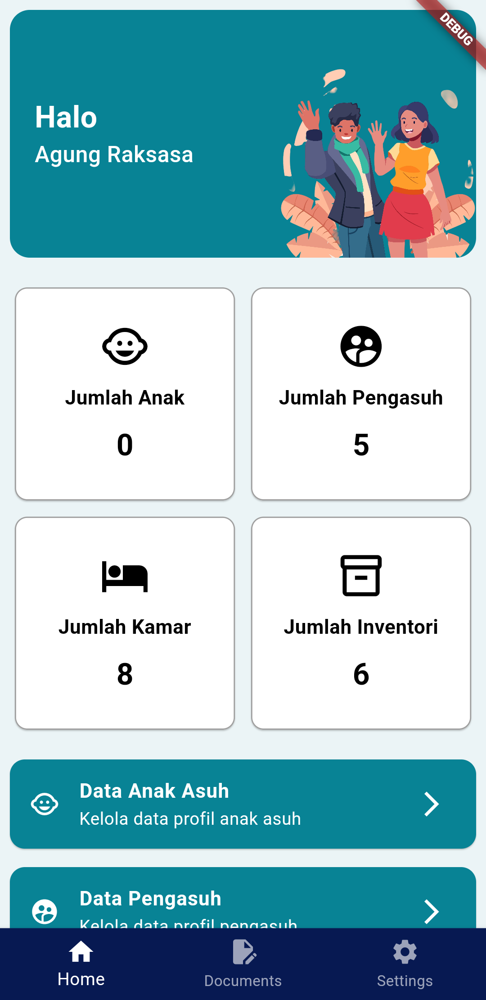

Here is a README file for your project:

---

# Orphan Care Flutter

Orphan Care Flutter is a comprehensive management application designed to streamline the processes involved in managing orphans, caretakers, documents, inventory, and bedrooms within an orphanage. This project is built using Flutter to ensure a smooth and responsive user experience across multiple platforms.

## Features

- **Orphan Management**: Keep track of orphan profiles, including personal information, health records, and educational progress.
- **Caretaker Management**: Manage caretaker profiles, assign duties, and monitor their activities and performance.
- **Document Management**: Organize and manage important documents related to the orphanage and its residents.
- **Inventory Management**: Track and manage the orphanage’s inventory, including food supplies, clothing, and other essential items.
- **Bedroom Management**: Allocate and manage bedroom assignments for orphans, ensuring optimal use of space and resources.

## Screenshots

Here are some screenshots of the application:

1. **Home Screen**


2. **Orphan Management**


3. **Inventory Management**


4. **Bedroom Management**


## Getting Started

### Prerequisites

- Flutter SDK
- Dart
- Android Studio or Visual Studio Code with Flutter extension

### Installation

1. Clone the repository:
   ```sh
   git clone https://github.com/ridhotamma/orphan-care-flutter.git
   ```
2. Navigate to the project directory:
   ```sh
   cd orphan-care-flutter
   ```
3. Install dependencies:
   ```sh
   flutter pub get
   ```

### Running the App

1. Connect your device or start an emulator.
2. Run the app:
   ```sh
   flutter run
   ```